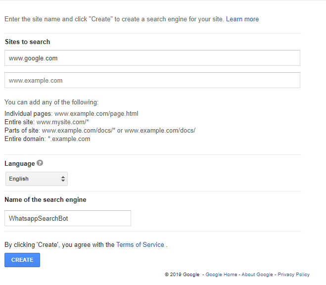
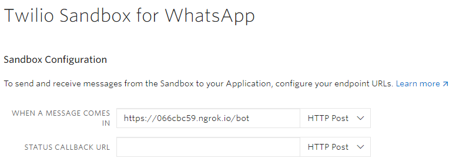

# js-whatsapp-bot
This is a Whatsapp Chatbot that responds with the top 5 responses on google for any keyword.

[](https://twitter.com/intent/tweet?text=Create%20a%20whatsapp%20chatbot%20search%20enginewith%20javascript%20and%20Twilio.&url=https://github.com/Ileriayo/js-whatsapp-bot&via=ileriayodavid&hashtags=chatbot,ai,javascript,future,twilio,developers)

# Usage
1. Download and install [Node](https://nodejs.org/en/).

2. Clone or fork this repository (project).
    ```
    $ git clone https://github.com/Ileriayo/js-whatsapp-bot.git

    $ cd js-whatsapp-bot
    ```

3. Install the project dependencies found in `package.json`
    ```
    npm install
    ```

4. Test the chatbot. 
    
    a. Get a Google API key from [here](https://developers.google.com/custom-search/v1/overview). You will need to create a new project from there (Note: you must have a google account to do this).
    
    See screenshot below:
    

    b. Create a custom search engine from [here](https://cse.google.com/cse/create/new).
    Under `sites to reach`, enter `www.google.com`.
    Give the search engine a name of your choice.
    Take note of the Search

    See the screenshot below:
    
    

    c. create a `.env` file. Paste the keys gotten from (a) and (b) above. See the `.env.example` file as an example of it's content.

    d. Run the app `npm run start:dev` (Take note of the Ngrok url displayed on the terminal)
    
    e. Create an account on [Twilio](https://www.twilio.com) and navigate to the [Whatsapp Sandbox](https://www.twilio.com/console/sms/whatsapp/sandbox). Follow the instructions from Twilio to get a test whatsapp account.
    At the end of the setup, paste the url from (d) above into the input field with the label `WHEN A MESSAGE COMES IN`. At the end of the URL, add '`/bot`' and hit save.

    See the screenshot below:
    

    **Bonus:** You can create a customized link for your Whatsapp chatbot. Use this template: `http://wa.me/<phone-number-from-twilio>?text=<code-to-join-sandbox>`.

    Send the link to your friends to try out the chatbot.

# Technologies Used
- NodeJS
- Google Custom Search API
- Twilio
- ngrok

# Author
Ileriayo Adebiyi

# Like It?
- Kindly star this repository🙏🥺. It will go a long way. Thanks!🤝
- [Click to tweet](https://twitter.com/intent/tweet?text=Create%20a%20whatsapp%20chatbot%20with%20python%20and%20Twilio.&url=https://github.com/Ileriayo/python-whatsapp-bot&via=ileriayodavid&hashtags=chatbot,ai,python,twilio,developers)

# Contact
Send me an [email](mailto:ileriayoadebiyi@gmail.com?subject=Build%20Me%20a%20Chatbot) to build a bespoke chatbot for unique business needs. Visit [my website](http://ileriayo.github.io/)

    
# License 
See [license](LICENSE)
